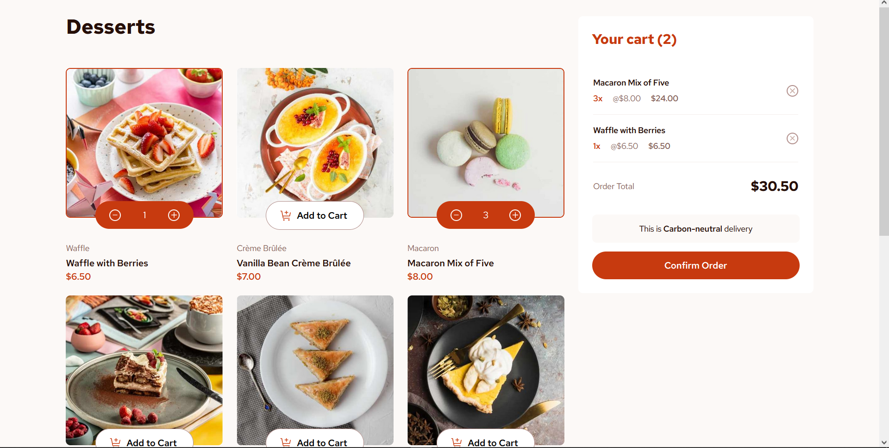

# Frontend Mentor - Product list with cart



## Design patterns used

1. Observer pattern
2. Singleton pattern
3. Module pattern

## Running locally

1. clone repository

```bash
git clone https://github.com/Raphico/product-list-with-cart.git
cd product-list-with-cart
```

2. run app with live server
